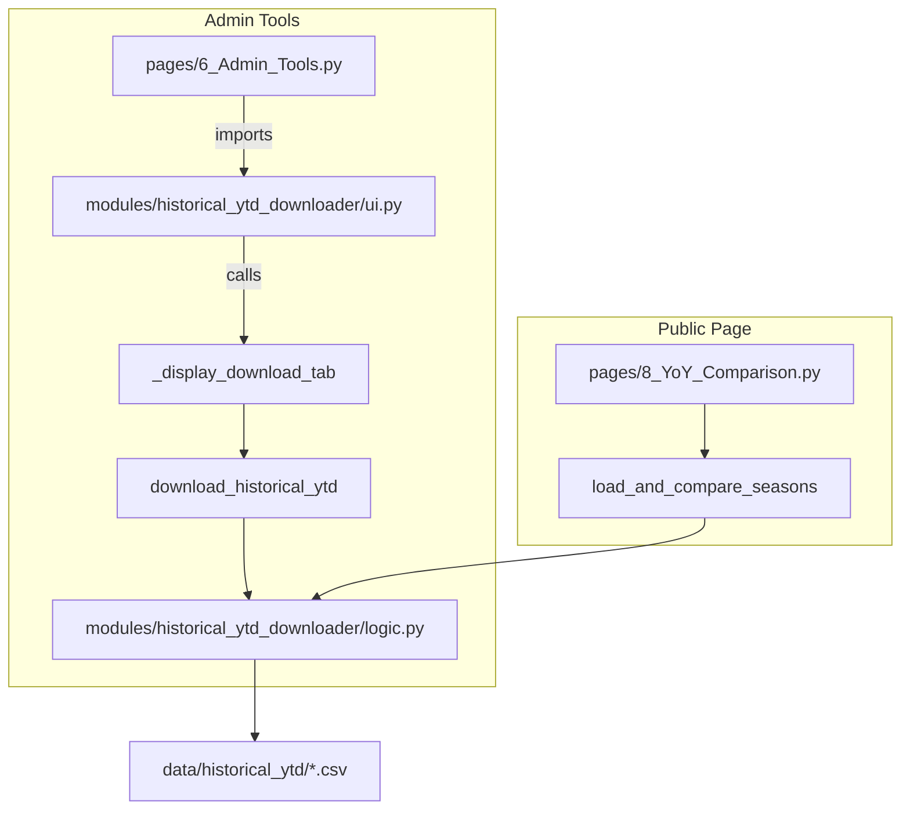

# Deep Dive: Historical YTD Archive & YoY Comparison

**Files:**
- `modules/historical_ytd_downloader/logic.py`
- `modules/historical_ytd_downloader/ui.py`
- `pages/6_Admin_Tools.py`
- `pages/8_YoY_Comparison.py`

---

## 1. Purpose and Context

This feature transforms raw Fantrax season-to-date exports into a reusable historical archive and an interactive Year-over-Year (YoY) comparison workspace. The downloader lives inside the Admin Tools section so commissioners can curate season files, while the comparison UI is exposed as a standalone public page for analysts to explore trends, breakouts, and regression candidates.

Key objectives:
- Fetch true historical YTD data for past seasons (2018-19 onward) instead of duplicating current-season stats.
- Normalize and deduplicate player rows across seasons so merges remain stable.
- Provide an always-on comparison page that automatically loads every available season for quick analysis.

---

## 2. Architecture Overview



- **Downloader UI (`ui.py`)** – Streams league selection, season checklist, and download progress inside Admin Tools.
- **Downloader Logic (`logic.py`)** – Handles authentication, Selenium session, and season-specific CSV exports.
- **YoY Comparison Page (`8_YoY_Comparison.py`)** – Public Streamlit page that consumes the archived CSVs, merges seasons with unique identifiers, and renders filters/metrics/exports.

---

## 3. Historical Download Contract (Nov 2025)

Earlier iterations attempted to replicate Fantrax reports via explicit date ranges. That approach always returned the active season, breaking the historical workflow. The downloader now mirrors the official `seasonOrProjection` API signature used by Fantrax UI downloads:

```
https://www.fantrax.com/fxpa/downloadPlayerStats?
    leagueId={league_id}&pageNumber=1&statusOrTeamFilter=ALL
    &seasonOrProjection=SEASON_41h_YEAR_TO_DATE
    &timeframeTypeCode=YEAR_TO_DATE
    &view=STATS&positionOrGroup=BASKETBALL_PLAYER
    ...
```

Implementation notes:
- `seasonOrProjection` selects the season (e.g., `SEASON_41j_YEAR_TO_DATE` for 2024-25, `SEASON_41f_YEAR_TO_DATE` for 2022-23).
- `timeframeTypeCode` is fixed at `YEAR_TO_DATE`.
- Filenames follow `Fantrax-Players-<League>-YTD-<Season>.csv` and are stored under `data/historical_ytd/`.

These fixes allow batching multiple seasons and guarantee the downloader produces distinct season datasets.

---

## 4. Data Normalization & Deduplication

Fantrax exports include thousands of non-NBA free agents listed with team `(N/A)` alongside legitimate NBA players that share the same display name. Without filtering, pandas merges would duplicate rows (e.g., Jaylin Williams from OKC vs. a G-League free agent).

`load_and_compare_seasons()` now enforces:

1. **Filter to Real Teams** – `df = df[df['Team'] != '(N/A)']`
2. **Stable Primary Key** – `Player_ID = ID + '|' + Player`, combining Fantrax GUID with the display name.
3. **Merge on Player_ID** – Ensures only identical players across seasons are merged.
4. **Drop Player_ID Before Display** – Keeps the UI clean while preserving deterministic joins.

The result is a deduplicated dataset where each NBA player appears once per season and YoY diffs are meaningful.

---

## 5. YoY Comparison UI Flow

`pages/8_YoY_Comparison.py` exposes the comparison to all users:

1. **League Selection** – Dropdown sourced from `FANTRAX_LEAGUE_IDS`/`NAMES` environment variables.
2. **Season Discovery** – Introspects `data/historical_ytd/` for matching CSVs and extracts the season token.
3. **Automatic Season Selection** – Uses every available season by default (no manual multi-select).
4. **Data Merge** – Calls `load_and_compare_seasons()` to create a wide table: `Player`, `FP/G_<season>`, `YoY_Change`, `YoY_Pct`.
5. **Filters & Metrics** – Min FP/G, YoY % thresholds, improver toggle, summary metrics (total players, improvers, decliners, breakouts).
6. **DataFrame & Export** – Rounded values, Streamlit column configs, CSV download button.
7. **Usage Tips** – Expander describing how to find buy-low, sell-high, and breakout candidates.

This page gives analysts instant insight into player trajectories without touching the admin-only download tools.

---

## 6. Operational Checklist

- Populate `fantrax.env` with aligned `FANTRAX_LEAGUE_IDS`/`NAMES` and `FANTRAX_DOWNLOAD_DIR`.
- From Admin Tools → Historical YTD Downloader:
  1. Select league.
  2. Choose desired seasons.
  3. Run downloads (progress status displayed).
- Visit the **YoY Comparison** page to verify the seasons appear automatically.
- Use the CSV export for external analysis (e.g., Notion, Google Sheets, Python notebooks).

---

## 7. Future Enhancements

- **Delta Annotations** – Highlight top improvers/decliners automatically in the UI.
- **Age & Role Overlays** – Append player age, minutes, or usage trends for richer context.
- **Automated Refresh** – Scheduled job to pull historical datasets nightly during the season.
- **Delta Threshold Presets** – One-click filters for "Breakouts", "Sell High", "Buy Low" slices.
