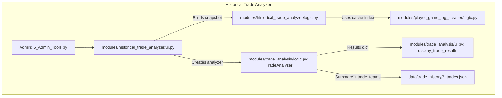

# Feature Deep Dive: Historical Trade Analyzer

**File Paths:**
- `modules/historical_trade_analyzer/logic.py`
- `modules/historical_trade_analyzer/ui.py`
- `modules/trade_analysis/logic.py` (shared `TradeAnalyzer`)
- `modules/trade_analysis/ui.py` (shared result UI + traded players logs)
- `modules/player_game_log_scraper/logic.py` (full game log cache + league index)

---

## 1. Purpose and Overview

The Historical Trade Analyzer is an admin-only tool that lets you rerun trades **as of a past date**, using cached game logs instead of the current CSV exports.

It answers a different question than the normal Trade Analysis page:

- **Trade Analysis (main page):**
  > "Given the latest CSV data for this league, how would this proposed trade impact the current rosters?"

- **Historical Trade Analyzer (Admin → Historical tab):**
  > "Given the rosters and game logs **at the time of the trade**, how did this trade look on that day?"

Key properties:

- Uses **per-game cached stats** from the Player Game Log Scraper, not the Fantrax CSV exports.
- Reconstructs a synthetic `combined_data` DataFrame as of a specific `trade_date`.
- Feeds that snapshot into the **same** `TradeAnalyzer` engine and **same UI components** as the main Trade Analysis.
- Writes historical runs into the shared trade history as `source: "historical"` entries, so they appear alongside live trades in the normal history view.

---

## 2. Architecture and Data Flow



High-level sequence:

1. **UI (Admin page)**
   - `show_historical_trade_analyzer()` renders:
     - Season dropdown (derived from the game-log league index).
     - `trade_date` input.
     - Trade label and `num_players` selector.
     - Multiselect for teams involved and per-team roster text areas.
     - A player/target selection widget to define `trade_teams`.

2. **Snapshot builder**
   - `build_historical_combined_data(trade_date, league_id, season, rosters_by_team)`:
     - Loads the **league cache index**: `player_game_log_index_{league_id}.json`.
     - Resolves `player_name → player_code` (case-insensitive) via `_build_player_code_index`.
     - For each rostered player:
       - Loads `player_game_log_full_{player_code}_{league_id}_{season}.json`.
       - Parses `Date` and `FPts` into a clean DataFrame.
       - Filters to games with `DateParsed <= trade_date`.
       - Computes stats for windows: `YTD`, `60 Days`, `30 Days`, `14 Days`, `7 Days`.
       - Emits rows of the form:
         - `Player, Team, Status, FPts, FP/G, GP, Timestamp`.
     - Returns a `combined_data` DataFrame with `Player` as index, mirroring the CSV-based combined data shape used by the main Trade Analysis.

3. **Analyzer + UI re-use**
   - The Historical UI constructs `TradeAnalyzer(snapshot_df)` and calls:

     ```python
     results = analyzer.evaluate_trade_fairness(trade_teams, num_players)
     ```

   - The `results` dict has the same shape as on the main page and is passed to `display_trade_results(results)` in `modules/trade_analysis/ui.py`.
   - This means all existing metrics, tables, visualizations, and insight text are reused without duplication.

4. **History integration**
   - Historical runs are persisted via the same helpers used by the main analyzer:

     ```python
     history = _load_trade_history()
     summary = analyzer._generate_trade_summary(results)
     entry = {
         "trade_teams": trade_teams,
         "summary": summary,
         "label": trade_label or "",
         "date": trade_date.isoformat(),
         "num_players": int(num_players),
         "source": "historical",
     }
     history.append(entry)
     _save_trade_history(history)
     ```

   - On the main Trade Analysis page, the "Trade Analysis History" expander reads the same file and displays historical entries together with live ones. Historical entries are distinguishable by `source: "historical"` and often by their labels.

---

## 3. Snapshot Logic Details

### 3.1 Building the player index

`_build_player_code_index(league_id) -> (name_to_code, index, cache_dir)`:

- Loads the league index JSON via `load_league_cache_index(league_id, rebuild_if_missing=True)`.
- Builds a `name_to_code` dict using **normalized** player names:

  ```python
  key = str(player_name).strip().lower()
  name_to_code[key] = player_code
  ```

- Returns:
  - `name_to_code`: name → player_code (case-insensitive).
  - `index`: full index payload, including per-player seasons and cache files.
  - `cache_dir`: disk location of the full game-log cache.

### 3.2 Loading game logs per player/season

`_load_player_games(player_name, league_id, season, name_to_code, index, cache_dir)`:

- Normalizes the requested name to a key and looks up the `player_code`.
- Chooses the correct cache file:
  - Uses the league index metadata when available.
  - Falls back to the standard filename: `player_game_log_full_{code}_{league_id}_{season}.json`.
- Loads JSON and extracts the `data` list.
- Builds a DataFrame and validates that `Date` and `FPts` columns exist.
- Parses dates with `_parse_game_dates_for_season(df["Date"], season)`:
  - The scraper stores dates as strings like `'Apr 11'` without a year.
  - For seasons of the form `"2024-25"`:
    - Months `>= Oct` are mapped to `2024`.
    - Months `< Oct` are mapped to `2025`.
- Converts `FPts` to numeric, drops invalid rows, and sorts by `DateParsed` descending.

If anything fails or no valid rows remain, the function returns an empty DataFrame and the player is skipped from the snapshot.

### 3.3 Rolling windows and output format

For each player with games up to `trade_date`:

1. Compute `games_filtered = games[DateParsed <= trade_date]`.
2. Define time windows:

   ```python
   windows = {
       "YTD": None,   # all games up to trade_date
       "60 Days": 60,
       "30 Days": 30,
       "14 Days": 14,
       "7 Days": 7,
   }
   ```

3. For each window, build a subset and compute stats via `_window_stats`:

   - `FP/G` (mean), `FPts` (total), `GP` (games), plus Median and StdDev (not all presented directly, but available).

4. Emit one row per `(player, window)` with:

   - `Player`: fantasy player name from roster input.
   - `Team`: real-life team from the most recent game row in `games_filtered`.
   - `Status`: fantasy team ID (the internal ID from `TEAM_MAPPINGS`).
   - `FP/G`, `FPts`, `GP` from the computed stats.
   - `Timestamp`: the window label (`"YTD"`, `"60 Days"`, etc.).

Finally, the function returns a `combined_data` DataFrame:

- Columns in order: `["Player", "Team", "Status", "FPts", "FP/G", "GP", "Timestamp"]`.
- `Player` is set as the index, matching the shape expected by `TradeAnalyzer`.

---

## 4. Historical UI Behavior

### 4.1 Inputs

`show_historical_trade_analyzer()` collects:

- **League/Season**
  - Uses `st.session_state["league_id"]` or `FANTRAX_DEFAULT_LEAGUE_ID`.
  - Reads the league cache index and builds a season dropdown from all indexed seasons.

- **Trade context**
  - `season`: the season string used for cache selection and date parsing.
  - `trade_date`: the date at which to freeze the snapshot.
  - `trade_label`: optional text label saved in history.
  - `num_players`: number of top players per team to include in analysis.

- **Teams and rosters**
  - Multiselect of team IDs from `TEAM_MAPPINGS`.
  - For each selected team, a text area:

    > "Roster for {TeamName} at trade time (one player per line)"

    with one player per line, representing the roster on the trade date.

- **Traded players**
  - `_historical_player_selection_interface` renders per-team multiselects of roster players and destination dropdowns.
  - Produces the `trade_teams` structure used by `TradeAnalyzer.evaluate_trade_fairness`.

### 4.2 Outputs & notes

- The Historical view reuses the standard Trade Analysis UI:
  - Team tabs, Trade Overview, metrics table, visualizations, roster before/after.
  - Trade insights including FP/G, total FPts, and consistency/Sharpe-style risk metrics.
- An additional caption reminds users:

  > "Rosters and results are shown as they were on the trade date. If players you remember are missing here, they were likely added or dropped at a different time and are no longer on the team today."

This clarifies why the snapshot may not match today’s live rosters.

---

## 5. Consistency & Game Log Integration

The Historical Analyzer leverages the same consistency and game-log tooling as the main Trade Analysis page, but now with season-aware selection and optional trade-date filtering.

### 5.1 Consistency metrics (season choice)

`modules/trade_analysis/consistency_integration.py` exposes:

- `load_player_consistency(player_name, league_id)`
- `enrich_roster_with_consistency(roster_df, league_id)`

For consistency metrics, it:

- Scans **full game-log** files: `player_game_log_full_*_{league_id}_*.json`.
- Filters by player name (case-insensitive).
- Picks the **most recent season** for that player (lexicographically largest `season` string).
- Computes:
  - `mean_fpts`, `std_dev`, `cv_percent` (coefficient of variation).
  - Boom/bust rates based on ±1 std dev.
  - A tier label (`Very Consistent`, `Moderate`, `Volatile`).

These metrics are then aggregated in `TradeAnalyzer.evaluate_trade_fairness` for the pre- and post-trade rosters and displayed in the Trade Analysis UI, including for historical runs.

### 5.2 Traded players' game logs (historical vs live)

In `modules/trade_analysis/ui.py`, `_display_traded_players_game_logs(results)`:

- Gathers all traded players: outgoing + incoming.
- For each player, scans `player_game_log_full_*_{league_id}_*.json` and:
  - If `results["season"]` is present (historical runs), prefers that season exactly.
  - Otherwise, picks the most recent season for that player.

For **historical trades** only, if both `season` and `trade_date` are present on the `results` dict, the function:

1. Parses the `Date` column using `_parse_game_dates_for_season(..., season)`.
2. Filters to rows where `DateParsed <= trade_date`.
3. Drops the helper column and displays the truncated log.

For **live trades** on the main Trade Analysis page, the full-season logs are shown without date cutoff.

---

## 6. Limitations and Edge Cases

- **Roster reconstruction is manual**
  - The Historical Analyzer trusts whatever rosters are entered into the text areas.
  - It does not infer rosters from Fantrax history or auto-tracked transactions.

- **Game log coverage**
  - Players with no cached game log file for the chosen season/league are silently skipped from the snapshot.
  - Very early trade dates (before a player’s first game) can result in zero GP and thus no contribution from that player.

- **Name matching**
  - Name matching is case-insensitive but otherwise literal.
  - Significant deviations from Fantrax’s name string (e.g., extra suffixes, reversed order) may fail to resolve.

- **Consistency season choice**
  - Consistency metrics always use the **latest** full game-log season available for that player/league, even in historical runs. This provides a modern volatility profile but is not strictly tied to the historical trade season.

---

## 7. When to Use Which Analyzer

- Use the **main Trade Analysis** page when:
  - Evaluating **proposed** trades in the current league context.
  - Working off the latest Fantrax CSV exports.

- Use the **Historical Trade Analyzer** when:
  - Auditing past trades after the fact.
  - Answering "What did this trade look like at the time, based only on information we had then?"
  - Building an archive of key trades under consistent, reproducible assumptions.

Both features share a common engine (`TradeAnalyzer`) and UI, but differ in how they construct their input `combined_data` and in whether they respect a historical trade date.

---

## 8. Persistence & Trade History Integration

### 8.1 History Entry Schema

The Historical Trade Analyzer writes into the same trade history file used by the main Trade Analysis feature:

- `data/trade_history/league_<league_id>_trades.json` 

When a historical trade is analyzed, the module:

1. Builds `snapshot_df = build_historical_combined_data(trade_date, league_id, season, rosters_by_team)`.
2. Runs `TradeAnalyzer(snapshot_df).evaluate_trade_fairness(trade_teams, num_players)`.
3. Generates a compact summary via `TradeAnalyzer._generate_trade_summary(results)`.
4. Appends a history entry:

```jsonc
{
  "trade_teams": { ... },        // team -> {player -> destination team}
  "summary": "Multi-line human summary by team/time range",
  "label": "User-entered label (optional)",
  "date": "2025-11-10",          // trade_date.isoformat()
  "num_players": 10,
  "source": "historical",
  "season": "2025-26",
  "rosters_by_team": {
    "PartyMar": ["Tre Johnson", "Jordan Poole", "..."],
    "Bomb": ["Grayson Allen", "Domantas Sabonis", "Zion Williamson", "..."]
  },
  "league_id": "ifa1anexmdgtlk9s"
}
```

Design decisions:

- We store **just enough** metadata to reconstruct the snapshot:
  - Exact rosters at the trade date.
  - Season and league id.
  - Trade mapping (`trade_teams`) and number of players (`num_players`).
- We intentionally **do not** persist the full `results` structure to avoid large files and drift when the analysis schema evolves.

### 8.2 Historical Snapshot Replay on the Main Trade Analysis Page

Although the Historical Trade Analyzer runs under **Admin Tools**, its results are surfaced on the primary Trade Analysis page via the shared trade history.

Replay path:

1. User opens **Trade Analysis → Trade Analysis History**.
2. Historical entries are marked with a `(historical snapshot)` badge.
3. Clicking **"View details"** on a historical entry triggers `_replay_trade_from_history(entry)` in `modules.trade_analysis.ui`.
4. `_replay_trade_from_history`:
   - Rebuilds `snapshot_df` via `build_historical_combined_data` using the stored `season`, `date`, `league_id`, and `rosters_by_team`.
   - Runs a fresh `TradeAnalyzer` on that snapshot.
   - Annotates each team’s results with:
     - `season` 
     - `trade_date` 
     - `league_id` 
   - Delegates to `display_trade_results` to render the usual metrics, tables, and charts.

Because the Historical Trade Analyzer uses the same `TradeAnalyzer` and `display_trade_results` components, the replayed view is visually and functionally identical to a live analysis, but **strictly read‑only** and backed by a deterministic historical snapshot.

### 8.3 Interaction with Game Logs & Consistency

Historical replay integrates tightly with the updated game‑log/consistency wiring:

- `results["league_id"]` and `results["season"]` guide:
  - `_display_traded_players_game_logs` in `modules.trade_analysis.ui` to:
    - Load the correct `player_game_log_full_*_{league_id}_*.json` file.
    - Select the correct season.
    - Filter rows to `Date <= trade_date` for historical trades.
  - Consistency loaders such as `load_player_consistency` in `modules.trade_analysis.consistency_integration` to pull metrics from the correct league and most recent or specified season.

This ensures that:

- The **Historical Trade Analyzer**, the **snapshot replay**, and the **live Trade Analyzer** all consume game logs and consistency metrics in a consistent way.
- Historical replays truly reflect “what we knew at the time,” limited to games that had occurred on or before the stored trade date.

### 8.4 Edge Cases & Fallbacks

- If a snapshot cannot be rebuilt (missing game logs, invalid date, etc.), replay shows a clear error and does not mutate history.
- If a user tries to replay an older entry without historical context fields, the system falls back to recomputing the trade using the current `combined_data`, labeled as a live recomputation rather than a historical snapshot.
