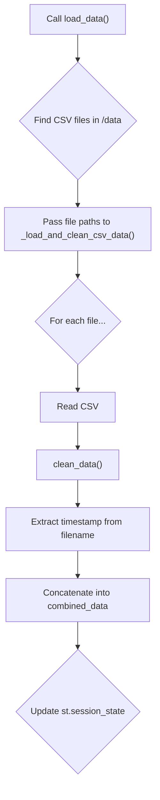
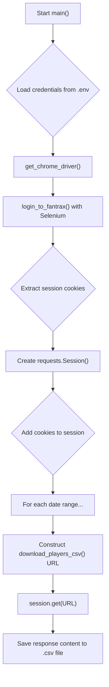
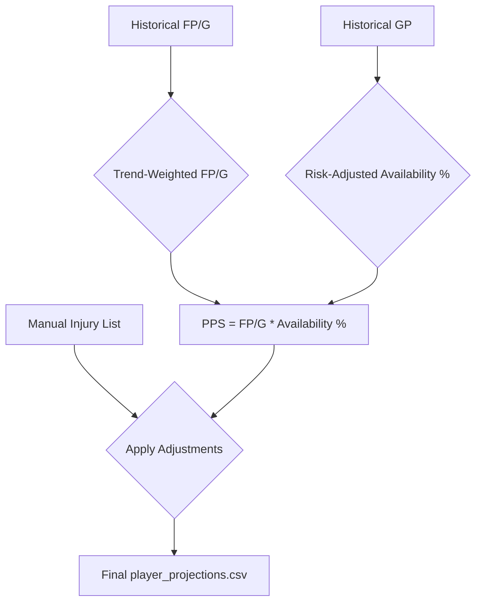

# Deep Dive: System Architecture, Data Flow, and Core Logic

This document provides a comprehensive technical overview of the Fantasy Trade Analyzer. It covers the application's file structure, how data flows through the system, and the core algorithms that power its features.

---

## 1. Core Application Files and Structure

The application follows a modular, multi-page Streamlit architecture designed for clarity and maintainability.

-   **`Home.py` (Application Entry Point)**: This is the first script executed. It handles page configuration, initializes the session state (`st.session_state`), and loads the default dataset on the user's first visit.

-   **`pages/` (Feature Entry Points)**: This directory contains the individual Python scripts for each of the application's main features (e.g., `1_Trade_Analysis.py`, `2_Auction_Draft_Tool.py`). Streamlit automatically uses these files to build the navigation sidebar. Each script serves as a controller for its respective feature.

-   **`modules/` (Reusable Components)**: This directory contains reusable pieces of UI and logic, often organized into subdirectories for each feature (e.g., `modules/trade_analysis/`, `modules/auction_tool/`). This promotes a DRY (Don't Repeat Yourself) approach and keeps the `pages/` scripts clean and focused on orchestration.

-   **`logic/` (Core Business Logic)**: This directory is the brain of the application. It contains the complex algorithms and data manipulation functions that are shared across features, such as player valuation, team optimization, and schedule analysis.

-   **`data/` (Data Storage)**: This directory is the default location for all raw data, including player stats CSVs, schedule files, and cached data.

---

## 2. Data Handling and Preparation

This section details the modules responsible for loading, downloading, and preparing data.

### 2.1. `data_loader.py`: Primary Data Ingestion

**Purpose**: This module is the primary engine for reading and parsing local CSV files containing player stats and league schedules.

**Key Functions**:
-   `clean_data()`: Standardizes raw data, converts types, and handles missing values.
-   `_load_and_clean_csv_data()`: A cached function (`@st.cache_data`) that efficiently loads multiple CSV files, extracting time-range metadata from filenames.
-   `load_schedule_data()`: A robust parser for the `schedule.csv` file, correctly identifying scoring periods, matchups, and winners.

**Data Loading Flowchart**:

### 2.2. `fantrax_downloader.py`: Automated Data Fetching

**Purpose**: This script automates fetching the latest player statistics directly from Fantrax, eliminating manual downloads.

**Core Technologies**:
-   **Selenium**: Used for web automation to programmatically log into Fantrax and obtain authentication cookies.
-   **Requests**: Used to perform the actual file download using the authenticated session cookies.

**Automation Flowchart**:

### 2.3. `modules/data_preparation.py`: Predictive Data Generation

**Purpose**: This module generates the forward-looking `player_projections.csv` file, which is the cornerstone of the Auction Draft Tool.

**Core Concept: Player Power Score (PPS)**

PPS is a composite score that provides a single, reliable number representing a player's overall fantasy value. It intelligently blends a player's historical performance with their historical availability (injury risk).

**PPS Calculation Diagram**:

---

## 3. Core Logic Modules

This section provides a summary of the key algorithm-heavy modules that power the application's most advanced features.

-   **`logic/auction_tool.py`**: The engine for calculating dynamic player values during an auction draft. It takes raw player projections and applies various valuation and scarcity models to produce in-draft adjusted values.

-   **`logic/schedule_analysis.py`**: Implements the logic for the schedule swap analysis. It can simulate swapping schedules between any two teams and calculate the impact on the final standings for the entire league.

-   **`logic/smart_auction_bot.py`**: Provides AI-driven advice during an auction draft. The bot analyzes the current state of the draft and recommends which players to nominate and how much to bid based on value and team need.

-   **`logic/team_optimizer.py`**: Implements an enhanced genetic algorithm to find the optimal team roster given a set of available players, a budget, and roster constraints. This is a key component for both pre-draft analysis and the smart auction bot's decision-making.

-   **`logic/ui_components.py`**: Contains functions for rendering the Streamlit user interface components for the auction draft tool, from setup to the live draft board.
