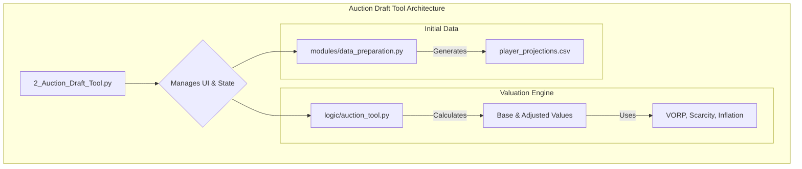
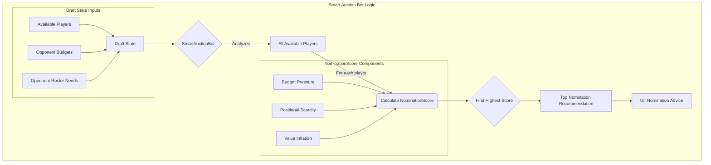

# Deep Dive: Auction Draft Tool

**File Path:** `pages/2_Auction_Draft_Tool.py`

## 1. Purpose and Overview

The Auction Draft Tool is a sophisticated, real-time assistant designed to help users navigate the complexities of a live fantasy basketball auction draft. It provides dynamic player valuations, roster management, and AI-driven strategic advice to help users build the best possible team within their budget constraints.

The feature is divided into two main phases:
1.  **Setup Phase**: Users configure draft settings (teams, budget, roster spots), generate baseline player projections, and set the nomination order.
2.  **Live Draft Phase**: The main interface where users track the draft, analyze players, and receive real-time nomination and bidding advice from the Smart Auction Bot.

---

## Recent Fixes (2025-08-07)

### 1. Draft Form Team Assignment
**Problem**: Drafted players were always assigned to Team 1 regardless of the selected team.
**Root Cause**: The draft form used an `on_click` callback with captured arguments, causing stale/default values.
**Fix**: Updated `logic/ui_components.py` to:
- Use explicit widget keys (`selectbox_team`, `number_input_price`, `selectbox_position`) for team, price, and position inputs.
- Remove `on_click` with captured args; instead, read values from `session_state` on form submission and pass them to the callback.
- This ensures the selected team is respected and players are assigned correctly.

### 2. Undo Last Pick Nominating Team
**Problem**: Undoing a pick did not revert the nominating team back to the previous team.
**Fix**: Updated `logic/ui_components.py` in the `Undo Last Pick` handler:
- After restoring the player, budget, and roster, set `current_nominating_team_index` to the previous team in the draft order.
- This ensures the correct team is back "on the clock" after an undo.

These changes maintain the existing architecture and do not affect the valuation engine or Smart Auction Bot logic.

---

## 2. Architecture and Core Components

The Auction Draft Tool relies on a tight integration of UI, data processing, and advanced logic modules.

-   **`pages/2_Auction_Draft_Tool.py`**: The main Streamlit entry point. It controls the UI flow, manages the session state, and orchestrates calls to the logic modules.
-   **`logic/auction_tool.py`**: The valuation engine. It's responsible for all player value calculations, both before and during the draft.
-   **`modules/data_preparation.py`**: Contains the logic to generate the initial `player_projections.csv` file from raw stats.

---

## 3. Key Concepts Explained

-   **Base Value**: A pre-draft valuation calculated once using the `calculate_initial_values` function. It is derived from a player's **Value Over Replacement Player (VORP)** and can be blended with market data or other models. This value is static.
-   **Adjusted Value (AdjValue)**: A dynamic, in-draft valuation that is recalculated after every pick. It adjusts the Base Value by factoring in:
    -   **Inflation/Deflation**: Tracks if teams are overpaying or underpaying for players relative to their Base Value. If money is being spent faster than value is being acquired, the remaining players' values inflate.
    -   **Scarcity**: As players of a certain position or tier are drafted, the value of the remaining players in that group increases.
-   **VORP (Value Over Replacement Player)**: Measures a player's contribution above a baseline, replacement-level player (defined as the top 85% of players expected to be drafted). It is the foundation of all value calculations.
-   **Tiers**: Players are grouped into tiers (1-5) based on their PPS (Player Performance Score) percentile. This is used for scarcity calculations and for applying weighted adjustments to VORP.

---

## 4. Core Logic: The Valuation Engine (`auction_tool.py`)

### `calculate_initial_values()`

This function runs once before the draft starts. Its key steps are:
1.  **Load Data**: Loads player projections (`pps_df`) and historical data.
2.  **Apply Injury Adjustments**: Reduces the PPS of injured players based on their expected time missed.
3.  **Calculate VORP**: Determines the replacement-level PPS and calculates the VORP for every player.
4.  **Assign Tiers**: Groups players into tiers using percentile cutoffs.
5.  **Calculate Base Value**: Computes a `BaseValue` for each player. It can average multiple models (e.g., Pure VORP, Risk-Adjusted VORP) selected by the user. It ensures any player with positive VORP has a minimum value of $1.
6.  **Store Initial Counts**: Records the initial number of players available at each position and in each tier. These counts are the baseline for scarcity calculations during the draft.

#### Early-Career Model (V2)

Young players (SeasonsPlayed ≤ 3) follow a separate early-career projection path before VORP/tiering:

- **Projection weighting**
  - Entering Year 2: `Projected FP/G = S4_FP/G`
  - Entering Year 3 (and 3 seasons played): `Projected FP/G = 0.8 × S4_FP/G + 0.2 × S3_FP/G`
- **Upside modifier** (multiplicative)
  - Tier 1: +15% (Top-10 pick AND `S4_FP/G ≥ EliteThreshold`)
  - Tier 2: +10% (Round 1 pick AND positive trend `S4 − S3 ≥ TrendDelta`)
  - Tier 3: +5% (default for other young players)
- **Injury sequencing**
  - Injuries are applied after the early-career projection, with gentler scaling for young players:
    - Young: Full=0.0, 3/4=×0.40, Half=×0.70, 1/4=×0.85
    - Veteran: Full=0.0, 3/4=×0.25, Half=×0.50, 1/4=×0.75
- **Controls** (Setup → Projections & Adjustments → Early-Career Model Settings)
  - Enable Early-Career Model (checkbox)
  - Elite FP/G threshold (default 85)
  - Trend delta FP/G (default 5)
  - Boosts: Tier1/Tier2/Tier3 (%) defaults 15/10/5
- **Pedigree support**: Optional `data/DraftPedigree.csv` with columns `PlayerName, DraftPickOverall, DraftRound`. If absent, young players default to Tier 3.

These adjustments replace `PPS` for qualifying players, and all downstream steps (tiers, VORP, BaseValue, AdjValue) reflect the boost.

### `recalculate_dynamic_values()`

This function runs after every player is drafted. It is the heart of the tool's real-time adjustments.
1.  **Calculate Preliminary Adjusted Value**: It first calculates a new baseline value for all remaining players based on the `remaining_money_pool` in the auction. If $1000 has been spent on players worth $800, the remaining money pool is adjusted, and the value of all remaining players increases.
2.  **Apply Scarcity Premiums**: It then applies one or more scarcity models selected by the user:
    -   **Positional Scarcity**: Calculates a premium based on the percentage of players at a position that have been drafted compared to the initial count.
    -   **Tier-Based Scarcity**: Does the same for tiers, increasing the value of remaining Tier 1 and Tier 2 players as they become rare.
3.  **Calculate Final `AdjValue`**: Averages the outputs of the selected scarcity models to produce the final, dynamic `AdjValue` for each player.
4.  **Confidence Score**: Calculates a confidence score based on the standard deviation of values across all selected models. A low deviation means high confidence.

---

## 5. Core Logic: The New Smart Auction Bot

The new `SmartAuctionBot` is designed with a single, aggressive goal: to recommend nominations that will strategically drain the most money from opponents' budgets, thereby creating value opportunities for the user later in the draft. It moves away from simple value-based recommendations to a more tactical, opponent-focused approach.

### Architecture and Data Flow

### Key Calculation: `NominationScore`

The core of the bot is the `NominationScore`, a metric calculated for every available player to determine their potential as a budget-draining nominee. The player with the highest score is recommended.

The score is a weighted sum of three factors:

1.  **Budget Pressure**: This component identifies players who are likely to start a bidding war. It's calculated by:
    *   Identifying all opponents who still need to fill the player's position.
    *   Summing the remaining budgets of those specific opponents.
    *   A player needed by three teams with a combined $400 budget will have a higher budget pressure score than a player needed by one team with $150.

2.  **Positional Scarcity**: This is a measure of supply and demand. It increases the score for players at positions where top talent is drying up.
    *   It's calculated based on the percentage of *top-tier* players at a position who have already been drafted.
    *   Nominating a top Center when only a few are left forces teams who need a Center to overpay.

3.  **Value Inflation**: This factor targets players whose perceived value (`AdjValue`) is significantly higher than their underlying base value. These players are prime candidates to nominate because they are likely to be overpriced.
    *   The score is higher for players with a large gap between their dynamic `AdjValue` and their static `BaseValue`.

### UI Requirement: Positional Assignment

To accurately track opponent roster needs, a new UI component is required. When a player with multiple eligible positions is drafted, the user will be prompted to assign them to a single position on the drafting team's roster. This ensures the bot's scarcity and budget pressure calculations are always based on precise data.

