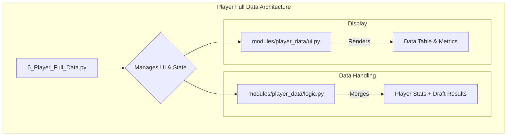

# Deep Dive: Player Full Data

**File Path:** `pages/5_Player_Full_Data.py`

## 1. Purpose and Overview

The Player Full Data page serves as the primary data exploration tool in the application. It provides a comprehensive, filterable table of all player statistics for a user-selected time range (e.g., Last 7 Days, Last 15 Days, Full Season). 

Its main purpose is to allow users to view and sort raw player performance data. If available, it also enriches this data by merging it with the league's draft results, showing the draft pick and auction bid for each player.

---

## 2. Architecture and Core Components

The architecture for this feature is simple and direct, involving one main page script and two small modules for logic and UI.

-   **`pages/5_Player_Full_Data.py`**: The Streamlit page entry point. It handles data loading checks, provides the time range selection dropdown, and calls the logic and UI modules.
-   **`modules/player_data/logic.py`**: Contains the business logic. Its sole function, `merge_with_draft_results`, performs a left merge to combine the player performance data with draft data.
-   **`modules/player_data/ui.py`**: Contains the display components. `display_player_dataframe` renders the main data table, and `display_player_metrics` shows summary statistics.

---

## 3. Core Logic

The core logic is centered around data retrieval and presentation.

1.  **Data Loading Check**: The page first verifies that a league dataset has been loaded on the Home page by checking `st.session_state.get('data_loaded', False)`. If not, it prompts the user to return to the Home page.
2.  **Time Range Selection**: It populates a dropdown with the available time ranges stored in `st.session_state.data_ranges`. The user's selection determines which dataset is displayed.
3.  **Draft Results Integration**:
    -   The script constructs a path to the league's draft results CSV file. The filename is dynamically created using the loaded league's name (e.g., `Fantrax-Draft-Results-MyLeague.csv`).
    -   If the file exists, it's loaded into a DataFrame.
    -   The `merge_with_draft_results` function is called to perform a left merge on the `Player` column, adding `Bid` and `Pick` columns to the main player data DataFrame.
    -   If the file doesn't exist, an error is shown, but the page still displays the player data without the draft information.
4.  **Display**: The final, potentially merged, DataFrame is passed to the UI functions to be rendered as a table and summary metrics.
