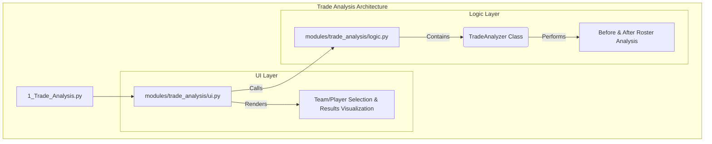

# Deep Dive: Trade Analysis

**File Path:** `pages/1_Trade_Analysis.py`

## 1. Purpose and Overview

The Trade Analysis feature is a core component of the application, designed to provide a deep, data-driven evaluation of fantasy basketball trades. It allows users to simulate a trade involving two or more teams and see a detailed breakdown of the statistical impact on each team's roster. The analysis compares key performance metrics before and after the proposed trade across multiple time ranges (e.g., YTD, Last 60 Days, Last 14 Days), helping users make informed trading decisions.

---

## 2. Architecture and Core Components

The feature's architecture is modular, separating the main page, UI rendering, and business logic into distinct components.

-   **`pages/1_Trade_Analysis.py`**: A lightweight entry point that sets the page configuration and calls the main UI display function.
-   **`modules/trade_analysis/ui.py`**: Manages the entire user interface. It's responsible for rendering the team and player selection widgets and for displaying the final analysis in a structured format with tabs, tables, and Plotly charts.
-   **`modules/trade_analysis/logic.py`**: Contains the `TradeAnalyzer` class, which is the engine of the feature. It handles all the data manipulation and statistical calculations required to evaluate a trade.

---

## 3. Core Logic: The `TradeAnalyzer` Class

The analysis is performed by the `evaluate_trade_fairness` method within the `TradeAnalyzer` class. Here is a step-by-step breakdown of its process:

1.  **Identify Players**: For each team involved in the trade, the method identifies the `outgoing_players` (those being traded away) and `incoming_players` (those being received).
2.  **Iterate Through Time Ranges**: The analysis is performed independently for each time range ('YTD', '60 Days', '30 Days', '14 Days', '7 Days').
3.  **Construct Pre-Trade Roster**: For a given time range, it takes the team's current roster and filters it down to the top `n` players based on Fantasy Points per Game (FP/G). This represents the team's core contributors.
4.  **Construct Post-Trade Roster**: It creates a hypothetical new roster by:
    -   Removing the `outgoing_players` from the team's data.
    -   Finding the `incoming_players`' data from the global dataset.
    -   Adding the `incoming_players` to the team.
    -   It then filters this new roster down to the top `n` players by FP/G.
5.  **Calculate Metrics**: For both the pre-trade and post-trade rosters, it calculates a dictionary of key performance metrics:
    -   `mean_fpg`: Mean Fantasy Points per Game
    -   `median_fpg`: Median Fantasy Points per Game
    -   `std_dev`: Standard Deviation of FP/G (a measure of consistency)
    -   `total_fpts`: Sum of all Fantasy Points
    -   `avg_gp`: Mean Games Played
6.  **Store Results**: All pre-trade and post-trade rosters and metrics are stored in a nested dictionary, which is returned to the UI layer for display.

---

## 4. UI and Visualization

The `ui.py` module takes the complex dictionary of results from the logic layer and presents it in an intuitive way:

-   **Team Tabs**: The results for each team are separated into their own tabs for clarity.
-   **Trade Overview**: A high-level summary shows which players are being received and traded away.
-   **Metrics Table**: A powerful table shows the Before -> After comparison for each key metric, with color-coding (green for improvement, red for decline) to quickly highlight the impact.
-   **Performance Charts**: Plotly line charts visualize the trend of key metrics (like FP/G) across all time ranges, making it easy to see if a trade provides a short-term gain but a long-term loss.
-   **Roster Details**: A side-by-side view of the pre-trade and post-trade rosters, with outgoing players highlighted in red and incoming players highlighted in green.
