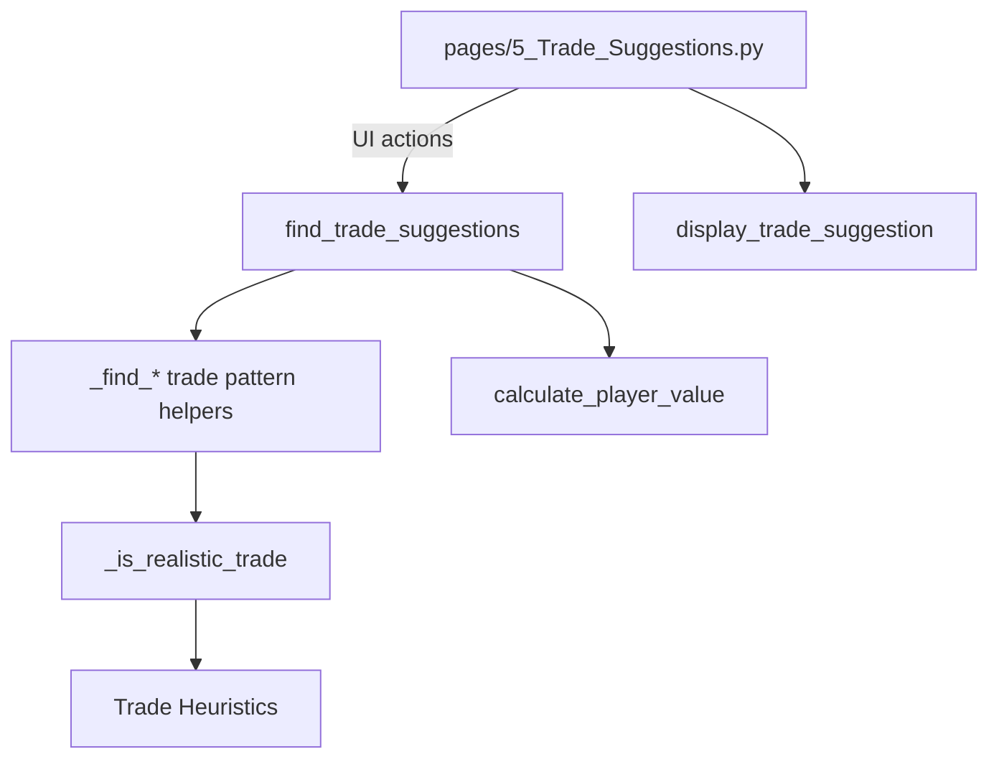

# Deep Dive: Trade Suggestions Engine

**Files:**
- `modules/trade_suggestions.py`
- `pages/5_Trade_Suggestions.py`

---

## 1. Purpose and Evolution

The Trade Suggestions engine scans league rosters to surface realistic trade ideas that improve a manager's roster while remaining plausible for opponents. It combines an exponential value system with layered realism heuristics, consistency metrics, and intuitive Streamlit visualizations. The November 2025 update focused on curbing unrealistic proposals by integrating CV% (consistency) checks, tightening imbalance thresholds, and validating individual player matchups.

---

## 2. Architecture Overview

- **UI Page (`pages/5_Trade_Suggestions.py`)** – Handles team selection, pattern filters, and renders each suggestion with charts, metrics, and a deep dive expander.
- **Engine (`modules/trade_suggestions.py`)** – Calculates exponential value per player, enumerates trade patterns (1-for-1 through 3-for-3), and filters proposals through `_is_realistic_trade` before ranking by value gain.

---

## 3. Exponential Value Model

`calculate_player_value()` combines three components:

1. **Production** – `(FPts ^ 1.5) * 0.5` emphasizes elite scorers.
2. **Consistency Modifier** –
   - CV% < 20 → +15%
   - 20 ≤ CV% ≤ 30 → neutral
   - CV% > 30 → scaled penalty down to -15%
3. **Sample Size Penalty** –
   - GP < 10 → 0.7x
   - 10 ≤ GP < 20 → 0.85x
   - GP ≥ 20 → 1.0x

This produces a single scalar value used for sorting and computing `value_gain` between rosters.

---

## 4. Realism Filter (Nov 2025)

`_is_realistic_trade()` enforces six sequential gates to avoid lopsided suggestions:

1. **Average Quality** – Max 15% difference in mean FPts between sides.
2. **Total Production** – Imbalance caps vary by pattern:
   - Equal players: 5%
   - Consolidation (more players given away): 15%
   - Expansion (more players received): 10%
3. **Consistency Trade-Off** – If giving up a lower CV% (more consistent) roster, require ≥5% FPts upgrade in return.
4. **Elite Protection** – 70+ FPts players must be exchanged for ≥50 FPts talent.
5. **Best Player Delta** – Top player ratio capped at 1.08 (8% difference).
6. **Player Matchups** – Sorted FPts lists compared pairwise, each within 10%.

Only trades that pass all layers are surfaced. This directly addressed user complaints about proposals that sent away superior, steadier players for riskier returns.

---

## 5. UI Enhancements & Deep Dive

`display_trade_suggestion()` now provides:

- **Side-by-side tables** with FPts and CV% per player.
- **Value comparison chart** highlighting total exponential values.
- **Trade rationale bullets** explaining production and consistency changes.
- **Deep Dive expander** covering:
  - Statistical breakdown (total FPts, Avg CV%, player counts)
  - Impact metrics (FPts change, CV% change, roster spots)
  - Tier analysis (Elite, Star, Solid, Streamer, Bench)
  - Strategic considerations (consolidation vs. expansion, risk profile)

This context helps managers understand why the engine recommends a trade and whether the move aligns with their roster strategy.

---

## 6. Workflow Summary

1. Load rosters from the selected league CSV.
2. Compute exponential value and consistency-adjusted scores for every player.
3. Iterate through trade patterns and team combinations.
4. For each candidate trade:
   - Calculate value gain.
   - Pass through `_is_realistic_trade` filters.
5. Rank surviving trades by value gain and limit to `max_suggestions`.
6. Render results with interactive insights on the Streamlit page.

---

## 7. Future Enhancements

- **Dynamic Threshold Tuning** – Allow power users to adjust realism caps or CV% sensitivity.
- **Positional Needs Analysis** – Highlight trades that rebalance positional scarcity.
- **Schedule Integration** – Consider future strength-of-schedule when ranking trades.
- **Scenario Saving** – Let users bookmark interesting trades to revisit later.
