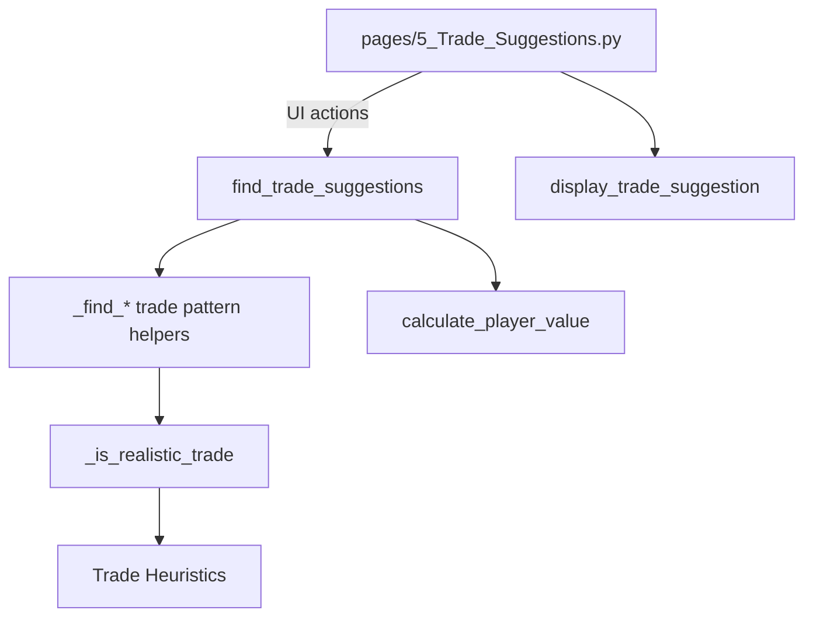

# Deep Dive: Trade Suggestions Engine

**Files:**
- `modules/trade_suggestions.py`
- `pages/5_Trade_Suggestions.py`

---

## 1. Purpose and Evolution

The Trade Suggestions engine scans league rosters to surface realistic trade ideas that improve a manager's roster while remaining plausible for opponents. It combines an exponential value system with layered realism heuristics, consistency metrics, and intuitive Streamlit visualizations. The November 2025 update focused on curbing unrealistic proposals by integrating CV% (consistency) checks, tightening imbalance thresholds, and validating individual player matchups.

---

## 2. Architecture Overview

- **UI Page (`pages/5_Trade_Suggestions.py`)** – Handles team selection, pattern filters, and renders each suggestion with charts, metrics, and a deep dive expander.
- **Engine (`modules/trade_suggestions.py`)** – Calculates exponential value per player, enumerates trade patterns (1-for-1 through 3-for-3), and filters proposals through `_is_realistic_trade` before ranking by value gain.

---

## 3. League-Aware Value Model with Trend Analysis

`calculate_player_value()` combines **six** components using actual league context and recent performance:

1. **Production** – `(FPts ^ 1.8) * 0.35` creates strong exponential scaling for elite players.
2. **Elite Tier Bonuses (Scarcity Premium)** –
   - 90+ FPts (Top 5): +30% bonus (Jokic, Giannis tier)
   - 80-90 FPts (Top 10): +15% bonus
   - 70-80 FPts (Top 20): +8% bonus
3. **Consistency Modifier** –
   - CV% < 20 → +15%
   - 20 ≤ CV% ≤ 30 → neutral
   - CV% > 30 → scaled penalty down to -15%
4. **Sample Size Penalty** –
   - GP < 10 → 0.7x
   - 10 ≤ GP < 20 → 0.85x
   - GP ≥ 20 → 1.0x
5. **League Scarcity Context** –
   - **Replacement Level**: Calculated from top 85% of rostered players (16 teams × 10 spots × 0.85)
   - **VORP Bonus**: Players above replacement get up to +30% based on distance above replacement
   - **Position Scarcity**: Rare positions (fewer rostered) get up to +10% bonus
   - **Tier Distribution**: Analyzes actual tier counts across league (Tier 1-6 based on FP/G)
6. **Trend Analysis** (NEW) –
   - Weighted recent performance: L7 (50%), L15 (30%), L30 (20%)
   - **Strong uptrend** (>10% better than YTD): +8% value
   - **Moderate uptrend** (5-10% better): +4% value
   - **Stable** (within 5%): no adjustment
   - **Moderate downtrend** (5-10% worse): -4% value
   - **Strong downtrend** (>10% worse): -8% value

**Example Values (context-dependent):**
- 45 FP/G player ≈ 200-240 value (depends on replacement level and position)
- 70 FP/G player ≈ 550-700 value (2.75x-3.5x more valuable)
- 95 FP/G player ≈ 1200-1560 value (6x-7.8x more valuable than 45 FP/G)

This produces a **league-aware** scalar value that reflects actual scarcity in your specific 16-team, 10-roster league.

---

## 4. Realism Filter (Nov 2025 - Significantly Tightened)

`_is_realistic_trade()` enforces multiple sequential gates to avoid lopsided suggestions:

1. **Average Quality Gap** – Stricter limits on mean FPts ratio:
   - Consolidation: Max 1.60x (your avg must be ≥62.5% of theirs)
   - Expansion: Max 1.25x
   - Equal counts: Max 1.15x
2. **Total Production Ratio** – Tight but flexible caps:
   - Consolidation targeting 80+ FP/G: Max 1.35x (35% gap)
   - Consolidation targeting 70-80 FP/G: Max 1.30x (30% gap)
   - Consolidation (other): Max 1.22x (22% gap)
   - Expansion: Max 1.15x
   - Equal counts: Max 1.08x
3. **Piece Quality Requirements** – Prevent "one good + scrubs" packages:
   - **2-for-1**: Your best must be ≥72% of target, second-best must be ≥55% of target
   - **3-for-1**: Your best must be ≥68% of target, all three must be ≥48% of target
3. **CV% Consistency Trade-off** – If giving up more consistent players, must receive at least 5% higher FPts (or 3% for consolidations with +8 FPts upgrade).
4. **Elite Tier Protection** – Strict requirements for top-tier players:
   - **Top 5 (90+ FP/G)**: Must receive 75+ FP/G back, or 80+ for 2-for-1/3-for-1
   - **Top 10-20 (70-90 FP/G)**: Must receive at least 50+ FP/G back
5. **Consolidation Upgrade Requirements** – Incoming player must meaningfully upgrade your top end:
   - Targeting 90+ FP/G: Your best must be 70+, upgrade must be +12 FP/G minimum
   - Targeting 80-90 FP/G: +10 FP/G upgrade minimum
   - Targeting 70-80 FP/G: +8 FP/G upgrade minimum
   - Regular consolidation: +5 FP/G minimum
6. **Best Player Gap** – Max ratio between best players on each side:
   - Consolidation targeting 90+: 1.20 (very strict)
   - Consolidation targeting 80-90: 1.22
   - Consolidation targeting 70-80: 1.25
   - Regular consolidation: 1.18
   - Expansion: 1.12
   - Equal: 1.08
7. **Individual Matchups** – Each player you give must have a comparable player you receive:
   - Consolidation targeting 90+: 1.28 ratio limit
   - Consolidation targeting 80-90: 1.32 ratio limit
   - Consolidation targeting 70-80: 1.35 ratio limit
   - Regular consolidation: 1.20
   - Expansion: 1.15
   - Equal: 1.10

Only trades that pass all layers are surfaced. This directly addressed user complaints about proposals that sent away superior, steadier players for riskier returns.

---

## 5. UI Enhancements & Deep Dive

`display_trade_suggestion()` now provides:

- **Side-by-side tables** with FPts and CV% per player.
- **Value comparison chart** highlighting total exponential values.
- **Trade rationale bullets** explaining production and consistency changes.
- **Deep Dive expander** covering:
  - Statistical breakdown (total FPts, Avg CV%, player counts)
  - Impact metrics (FPts change, CV% change, roster spots)
  - Tier analysis (Elite, Star, Solid, Streamer, Bench)
  - Strategic considerations (consolidation vs. expansion, risk profile)

This context helps managers understand why the engine recommends a trade and whether the move aligns with their roster strategy.

---

## 6. Workflow Summary

1. Load rosters from the selected league CSV.
2. Compute exponential value and consistency-adjusted scores for every player.
3. Iterate through trade patterns and team combinations.
4. For each candidate trade:
   - Calculate value gain.
   - Pass through `_is_realistic_trade` filters.
5. Rank surviving trades by value gain and limit to `max_suggestions`.
6. Render results with interactive insights on the Streamlit page.

---

## 7. Future Enhancements

- **Dynamic Threshold Tuning** – Allow power users to adjust realism caps or CV% sensitivity.
- **Positional Needs Analysis** – Highlight trades that rebalance positional scarcity.
- **Schedule Integration** – Consider future strength-of-schedule when ranking trades.
- **Scenario Saving** – Let users bookmark interesting trades to revisit later.
