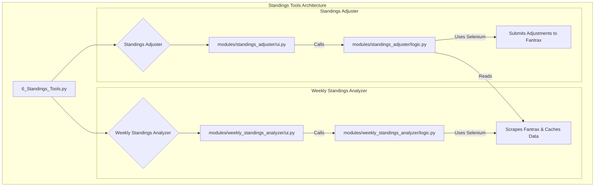

# Deep Dive: Standings Tools

**File Path:** `pages/6_Standings_Tools.py`

## 1. Purpose and Overview

The Standings Tools feature provides a powerful suite of utilities for league commissioners to manage and analyze their fantasy league standings directly from Fantrax. It is composed of two main components:

1.  **Weekly Standings Analyzer**: Scrapes weekly standings data, calculates adjusted scores based on a configurable games-played limit, and caches the results locally.
2.  **Standings Adjuster**: Loads the cached, adjusted scores and provides a one-click submission to apply those adjustments back to the Fantrax league.

This two-step process ensures that commissioners can first review the calculated adjustments before committing them, providing a safe and transparent workflow.

---

## 2. Architecture and Core Components

The feature is architected around two independent but connected modules, each with its own UI and logic. A parent page, `6_Standings_Tools.py`, uses tabs to provide access to each tool.

-   **`pages/6_Standings_Tools.py`**: The main entry point that houses the two tools in separate tabs.
-   **`modules/weekly_standings_analyzer/`**: Contains the UI and logic for fetching, analyzing, and caching the standings data.
-   **`modules/standings_adjuster/`**: Contains the UI and logic for reading the cached data and submitting it back to Fantrax.

---

## 3. Core Logic: Weekly Standings Analyzer

The `get_weekly_standings` function in `logic.py` is the heart of the analyzer. It uses **Selenium** to automate a web browser to perform the following steps:

1.  **Login**: It first logs into Fantrax using the credentials stored in the `fantrax.env` file.
2.  **Navigate**: It navigates to the specific league's standings page for the requested scoring period.
3.  **Scrape Data**: It uses **BeautifulSoup** to parse the HTML of the page and extract the standings table, which includes team names, ranks, and all statistical categories.
4.  **Cache Data**: The scraped data, along with the `min_games` value used for the query, is saved as a JSON file in the `data/weekly_standings_cache` directory. This local cache prevents redundant scraping and speeds up subsequent analyses.
5.  **Calculate Adjustments**: The `calculate_adjusted_scores` function then calculates the penalty for teams that exceeded the games-played limit for the week. The formula is:
    -   `Games Over = MAX(0, Games Played - Minimum Games)`
    -   `Adjustment = Games Over * (Total Fantasy Points / Games Played)`
    -   `Adjusted FPts = Total Fantasy Points - Adjustment`

---

## 4. Core Logic: Standings Adjuster

The `Standings Adjuster` provides the final step in the workflow. Its logic is handled by the `submit_adjustments_to_fantrax` function:

1.  **Load Cached Data**: It first loads the appropriate cached JSON file created by the analyzer.
2.  **Login and Navigate**: Like the analyzer, it uses Selenium to log into Fantrax and navigate to the **Scoring Adjustments** page for the correct league and period.
3.  **Apply Adjustments**: It iterates through the teams on the page, finds the corresponding adjustment value from the cached data, and enters it into the correct input field on the web page.
4.  **Submit**: Finally, it programmatically clicks the "Submit" button to save the changes to Fantrax, completing the adjustment process.
