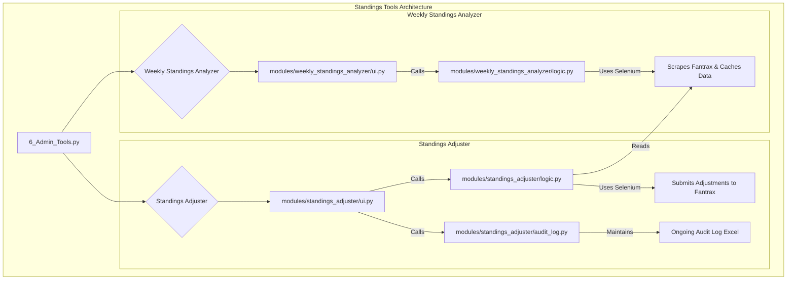

# Deep Dive: Standings Tools

**File Path:** `pages/6_Admin_Tools.py` (Standings Tools tabs)

## 1. Purpose and Overview

The Standings Tools feature provides a powerful suite of utilities for league commissioners to manage and analyze their fantasy league standings directly from Fantrax. It is composed of three main components:

1.  **Weekly Standings Analyzer**: Scrapes weekly standings data, calculates adjusted scores based on a configurable games-played limit, and caches the results locally.
2.  **Standings Adjuster**: Loads the cached, adjusted scores and provides adjustment logging and submission to Fantrax.
3.  **Audit Log**: Maintains an ongoing Excel file that tracks all adjustments made over time for complete transparency and record-keeping.

This multi-step process ensures that commissioners can first review the calculated adjustments, log them for audit purposes, and then submit them to Fantrax, providing a safe, transparent, and auditable workflow.

---

## 2. Architecture and Core Components

The feature is architected around two independent but connected modules, each with its own UI and logic. A parent page, `pages/6_Admin_Tools.py`, uses tabs to provide access to each tool within the broader Admin Tools hub.

-   **`pages/6_Admin_Tools.py`**: The main entry point that houses the two tools in separate tabs alongside other admin features.
-   **`modules/weekly_standings_analyzer/`**: Contains the UI and logic for fetching, analyzing, and caching the standings data.
-   **`modules/standings_adjuster/`**: Contains the UI and logic for reading the cached data, logging adjustments, and submitting them to Fantrax.
-   **`modules/standings_adjuster/audit_log.py`**: Manages the ongoing audit log Excel file that tracks all adjustments.

---

## 3. Core Logic: Weekly Standings Analyzer

The `get_weekly_standings` function in `logic.py` is the heart of the analyzer. It uses **Selenium** to automate a web browser to perform the following steps:

1.  **Login**: It first logs into Fantrax using the credentials stored in the `fantrax.env` file.
2.  **Navigate**: It navigates to the specific league's standings page for the requested scoring period.
3.  **Scrape Data**: It uses **BeautifulSoup** to parse the HTML of the page and extract the standings table, which includes team names, ranks, and all statistical categories.
4.  **Cache Data**: The scraped data, along with the `min_games` value used for the query, is saved as a JSON file in the `data/weekly_standings_cache` directory. This local cache prevents redundant scraping and speeds up subsequent analyses.
5.  **Calculate Adjustments**: The `calculate_adjusted_scores` function then calculates the penalty for teams that exceeded the games-played limit for the week. The formula is:
    -   `Games Over = MAX(0, Games Played - Minimum Games)`
    -   `Adjustment = Games Over * (Total Fantasy Points / Games Played)`
    -   `Adjusted FPts = Total Fantasy Points - Adjustment`

---

## 4. Core Logic: Standings Adjuster

The `Standings Adjuster` provides the final steps in the workflow, including audit logging and submission to Fantrax.

### Adjustment Review and Logging

1.  **Load Cached Data**: Loads the appropriate cached JSON file created by the analyzer.
2.  **Display Adjustments**: Shows calculated adjustments in the UI for review.
3.  **Log to Audit File** (Optional but recommended): The `append_adjustment_to_log` function:
    -   Creates or opens the ongoing audit log Excel file for the league
    -   Appends a new entry for each team with timestamp, period, and all adjustment details
    -   Updates the summary sheet with period-level statistics
    -   Saves the file with proper formatting and highlighting

### Submission to Fantrax

The `submit_adjustments_to_fantrax` function handles the actual submission:

1.  **Login and Navigate**: Uses Selenium to log into Fantrax and navigate to the **Scoring Adjustments** page for the correct league and period.
2.  **Apply Adjustments**: Iterates through the teams on the page, finds the corresponding adjustment value from the cached data, and enters it into the correct input field on the web page.
3.  **Submit**: Programmatically clicks the "Submit" button to save the changes to Fantrax, completing the adjustment process.

---

## 5. Audit Log System

The audit log system provides complete transparency and record-keeping for all adjustments. See the dedicated deep dive document: **`191_Adjustment_Audit_Log.md`** for comprehensive details.

### Key Features:

-   **Single Ongoing File**: One Excel file per league that grows over time
-   **Append-Only**: Never overwrites history, always adds new entries
-   **Complete Tracking**: All before/after values, calculations, and timestamps
-   **Two Sheets**: 
    -   "Adjustment History" - Complete log of every adjustment
    -   "Summary" - Period-by-period overview
-   **Download Anytime**: Button to download current audit log
-   **Reset Functionality**: Triple-confirmation system to delete audit log for testing

### Workflow Integration:

1.  Run Weekly Standings Analyzer (scrapes and caches data)
2.  Open Standings Adjuster
3.  Select league and period
4.  Review calculated adjustments
5.  **Click "📝 Log to Audit File"** - Appends to ongoing Excel file
6.  Click "🚀 Submit to Fantrax" - Submits to Fantrax (optional)

---

## 6. Related Documentation

-   **Audit Log Deep Dive**: `plan/deep_dive/191_Adjustment_Audit_Log.md` - Complete documentation of the audit log system
-   **Main README**: Project-level documentation and setup instructions
-   **Fantrax Integration**: See `fantrax.env.example` for required credentials
