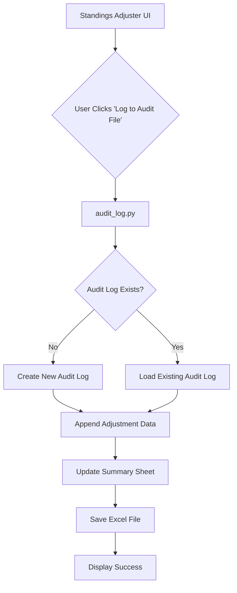

# Deep Dive: Adjustment Audit Log

**File Path:** `modules/standings_adjuster/audit_log.py`

## 1. Purpose and Overview

The Adjustment Audit Log maintains a **single, ongoing Excel file** that tracks the complete history of all standings adjustments for a league. This provides an easily auditable record of every adjustment made, including all before/after values, calculations, and timestamps.

### Key Characteristics

- **Single File Per League**: One audit log file per league that grows over time
- **Append-Only**: New adjustments are added to the existing file, never overwriting history
- **Comprehensive Tracking**: Every value before adjustment, calculation details, and final submitted values
- **Timestamp-Based**: Each entry includes when the adjustment was logged
- **Easy to Audit**: Organized in Excel format for easy review and analysis

---

## 2. Architecture



### Module Structure

- **`audit_log.py`**: Core module handling all audit log operations
  - `append_adjustment_to_log()` - Adds new adjustment entries
  - `create_new_audit_log()` - Creates initial audit log structure
  - `calculate_adjustment_details()` - Computes all adjustment metrics
  - `get_audit_log_info()` - Returns audit log status
  - `get_audit_log_path()` - Returns file path for league's audit log

---

## 3. Excel Workbook Structure

### File Naming
```
adjustment_audit_log_{league_name}.xlsx
```

Example: `adjustment_audit_log_My_Fantasy_League.xlsx`

### Sheet 1: Adjustment History

This is the main log sheet that contains every adjustment entry.

#### Columns:
| Column | Description | Example |
|--------|-------------|---------|
| **Timestamp** | When the adjustment was logged | 2024-10-26 23:45:12 |
| **Period** | Scoring period number | 1 |
| **Team Name** | Fantasy team name | Kevin O'Leary |
| **Team ID** | Fantrax team ID | k5likntnm03y4myx |
| **Min Games** | Games-played limit for this period | 25 |
| **GP** | Games played by team | 27 |
| **Original FPts** | Fantasy points before adjustment | 1437.0 |
| **Calc FP/G** | Calculated FP per game | 53.22 |
| **Games Over** | Games beyond limit | 2 |
| **Adjustment Amount** | Points deducted | 106.44 |
| **Adjustment %** | Percentage of original points | 7.41% |
| **Adjusted FPts** | Final points after adjustment | 1330.56 |
| **Submitted Value** | Value submitted to Fantrax | -106 |

#### Visual Features:
- **Yellow highlighting**: Rows with adjustments > 0
- **Bold text**: Adjustment amounts > 0
- **Frozen header row**: Easy scrolling through history
- **Auto-sized columns**: Readable without manual adjustment

### Sheet 2: Summary

Provides a period-by-period summary of all adjustments.

#### Columns:
| Column | Description |
|--------|-------------|
| **Period** | Scoring period number |
| **Date Processed** | When this period was logged |
| **Min Games** | Games limit used |
| **Teams Adjusted** | Number of teams with adjustments |
| **Total Adjustment** | Sum of all adjustments |
| **Avg Adjustment** | Average adjustment per team |
| **Max Adjustment** | Largest single adjustment |

---

## 4. Workflow

### Step 1: Analyze Standings
1. User runs **Weekly Standings Analyzer**
2. Data is scraped from Fantrax and cached locally
3. Adjustments are calculated based on min games limit

### Step 2: Review Adjustments
1. User opens **Standings Adjuster**
2. Selects league and period
3. Reviews calculated adjustments in UI

### Step 3: Log to Audit File
1. User clicks **"📝 Log to Audit File"** button
2. System checks if audit log exists for this league
   - If no: Creates new audit log with proper structure
   - If yes: Opens existing audit log
3. Appends new entries to "Adjustment History" sheet
4. Updates "Summary" sheet with period totals
5. Saves file and displays success message

### Step 4: Submit to Fantrax (Optional)
1. User clicks **"🚀 Submit to Fantrax"** button
2. Adjustments are submitted via Selenium automation
3. Fantrax standings are updated

---

## 5. Data Calculations

### Games Over Limit
```python
Games_Over = MAX(0, GP - Min_Games)
```

### Adjustment Amount
```python
Calc_FPG = Original_FPts / GP
Adjustment_Amount = Games_Over × Calc_FPG
```

### Adjustment Percentage
```python
Adjustment_Pct = (Adjustment_Amount / Original_FPts) × 100
```

### Adjusted Fantasy Points
```python
Adjusted_FPts = Original_FPts - Adjustment_Amount
```

### Submitted Value
```python
Submitted_Value = -ROUND(Adjustment_Amount, 0)
```
*Note: Negative because Fantrax expects penalties as negative values*

---

## 6. File Storage

### Audit Log Directory
```
data/audit_logs/
```

All audit log files are stored in this directory, one file per league.

### Cache Directory
```
data/weekly_standings_cache/
```

Source data comes from JSON files in this directory, created by the Weekly Standings Analyzer.

---

## 7. UI Integration

### Standings Adjuster Page

#### Audit Log Status Section
- Shows if audit log exists for selected league
- Displays number of periods logged
- Provides download button for existing audit log
- Shows file size and name

#### Period Review Section
- Select period to adjust
- View calculated adjustments
- Two action buttons:
  - **📝 Log to Audit File** (Primary) - Appends to audit log
  - **🚀 Submit to Fantrax** - Submits to Fantrax

---

## 8. Use Cases

### 1. Historical Record Keeping
- Maintain permanent record of all adjustments
- Track when adjustments were made
- Review past decisions

### 2. Audit Trail
- Provide transparency to league members
- Show exact calculations used
- Demonstrate consistency in enforcement

### 3. Pattern Analysis
- Identify teams frequently exceeding limits
- Analyze impact of different min games settings
- Review adjustment trends over time

### 4. Dispute Resolution
- Reference exact values and calculations
- Show timestamp of when adjustment was made
- Provide complete context for decisions

---

## 9. Key Features

### Append-Only Design
- Never overwrites existing data
- Complete history preserved
- Safe to log same period multiple times (creates new entries)

### Single File Per League
- Easy to manage and share
- All history in one place
- No need to consolidate multiple files

### Automatic Formatting
- Professional appearance
- Color-coded highlights
- Proper column widths
- Frozen headers for scrolling

### Timestamp Tracking
- Every entry includes date/time
- Can track when adjustments were processed
- Useful for identifying when changes were made

---

## 10. Technical Implementation

### Module: `audit_log.py`

#### Key Functions

**`append_adjustment_to_log(league_id, period, league_name, notes)`**
- Main function to add adjustment entries
- Creates new audit log if doesn't exist
- Appends team-by-team data to history sheet
- Updates summary sheet
- Returns success status and filepath

**`create_new_audit_log(filepath, league_id, league_name)`**
- Creates initial Excel structure
- Sets up both sheets with headers
- Applies formatting and styling
- Returns workbook object

**`calculate_adjustment_details(raw_data, min_games)`**
- Computes all adjustment metrics
- Calculates FP/G, games over, adjustments
- Returns DataFrame with all calculated fields

**`get_audit_log_info(league_id, league_name)`**
- Checks if audit log exists
- Returns file info (periods logged, file size)
- Used by UI to display status

**`get_audit_log_path(league_id, league_name)`**
- Returns Path object for audit log file
- Ensures audit directory exists
- Consistent naming across functions

---

## 11. Requirements

### Python Packages
- `openpyxl>=3.1.0` - Excel file manipulation
- `pandas>=2.1.3` - Data processing
- `pathlib` - File path handling

### Installation
```bash
pip install openpyxl pandas
```

---

## 12. Example Audit Log Entry

```
Timestamp: 2024-10-26 23:45:12
Period: 1
Team Name: Give me the fentanyl
Team ID: cltpoc6lm03y4mz2
Min Games: 25
GP: 27
Original FPts: 1437.0
Calc FP/G: 53.22
Games Over: 2
Adjustment Amount: 106.44  [HIGHLIGHTED IN YELLOW]
Adjustment %: 7.41%
Adjusted FPts: 1330.56
Submitted Value: -106
```

---

## 13. Best Practices

1. **Log Before Submitting**: Always log to audit file before submitting to Fantrax
2. **Download Regularly**: Periodically download audit log for backup
3. **Review Summary Sheet**: Check summary sheet for patterns and trends
4. **Share with League**: Provide audit log to league members for transparency
5. **Keep Organized**: One audit log per league, don't create duplicates

---

## 14. Troubleshooting

### "No cached data found"
- Run Weekly Standings Analyzer first
- Ensure correct league and period selected

### Audit log won't open
- Verify Excel or compatible software installed
- Try Google Sheets or LibreOffice Calc

### Duplicate entries
- Audit log is append-only by design
- Multiple logs of same period create separate entries
- This is intentional for complete audit trail

### File size growing large
- Normal behavior as history accumulates
- Excel handles thousands of rows efficiently
- Consider archiving old seasons if needed

---

## 15. Reset Functionality (Testing)

### Purpose
Allows resetting (deleting) the audit log for testing purposes while maintaining safety through multiple confirmations.

### Location
Hidden in expandable "⚠️ Danger Zone - Reset Audit Log" section in the Standings Adjuster UI.

### Triple Confirmation System

**Checkpoint 1:**
- Checkbox: "I understand this will delete all audit history"
- Must be checked first before other options appear

**Checkpoint 2:**
- Checkbox: "I have downloaded a backup of the audit log if needed"
- Only enabled after Checkpoint 1
- Encourages user to download backup first

**Checkpoint 3:**
- Checkbox: "I am absolutely sure I want to permanently delete this audit log"
- Only enabled after Checkpoint 2
- Final confirmation before delete button appears

**Delete Button:**
- Only visible after all three checkboxes are checked
- Button text: "🗑️ PERMANENTLY DELETE AUDIT LOG"
- Shows success message and refreshes UI on completion

### Technical Implementation

**File Lock Handling:**
- Explicitly closes openpyxl workbook after reading (`workbook.close()`)
- Reads file data into memory before passing to download button
- Adds 0.5 second delay before delete attempt
- Implements retry logic (3 attempts with 1 second delays)
- Handles Windows file locking gracefully

**Function: `reset_audit_log(league_id, league_name)`**
```python
# Give Windows a moment to release any file locks
time.sleep(0.5)

# Try to delete the file with retry logic
max_attempts = 3
for attempt in range(max_attempts):
    try:
        filepath.unlink()
        return True, f"Audit log successfully deleted: {filepath.name}"
    except PermissionError:
        if attempt < max_attempts - 1:
            time.sleep(1)  # Wait longer between retries
        else:
            raise
```

### Safety Features
- Hidden in collapsible expander
- Shows number of periods that will be lost
- Requires three sequential confirmations
- Each checkbox must be checked in order
- Clear warning messages throughout
- Encourages backup before deletion

### Use Cases
- **Testing**: Reset audit log between test runs
- **Development**: Clear test data during development
- **Fresh Start**: Begin new season with clean audit log
- **Error Recovery**: Remove corrupted audit log

---

## 16. Future Enhancements

Potential additions:
- Notes field for each adjustment
- User tracking (who made the adjustment)
- Comparison to previous periods
- Charts and visualizations
- Export to PDF for sharing
- Email notifications when logged
- Backup/restore functionality
- Archive old seasons automatically
